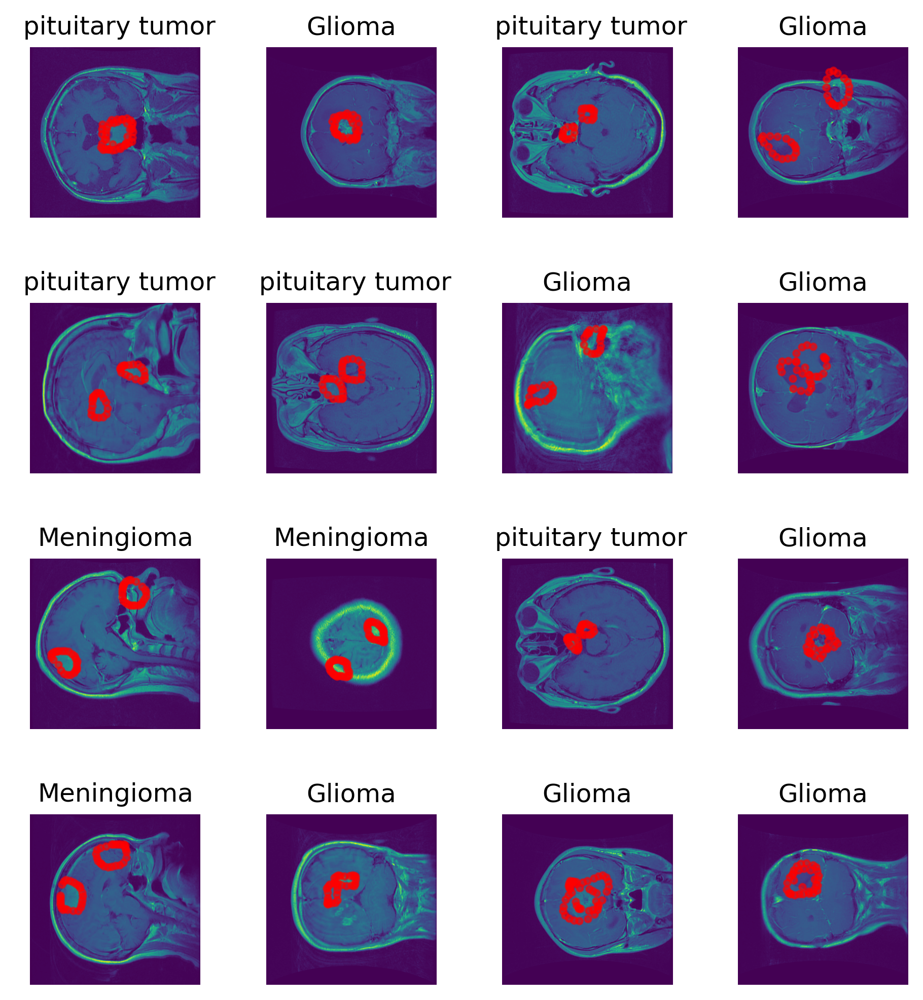
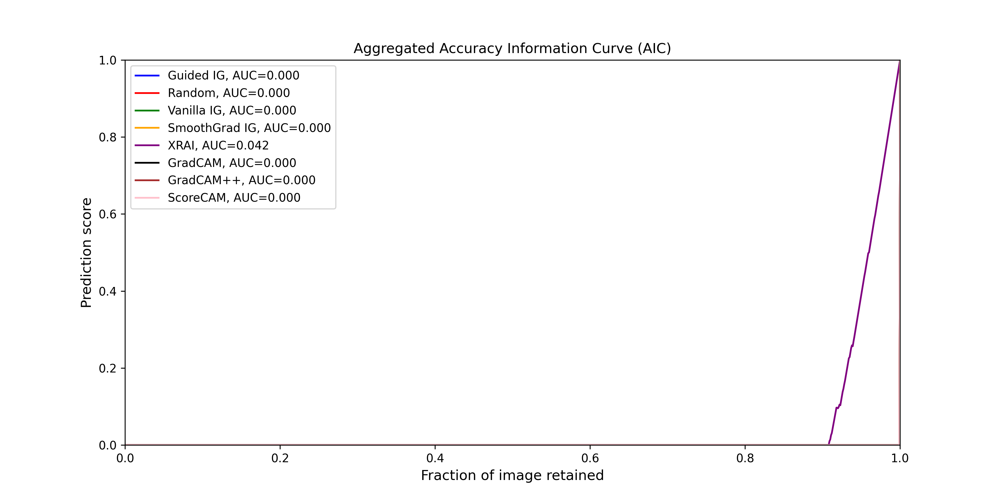

# XAIBiomedical

TensorFlow implementation for the pre-print [Visual Interpretable and Explainable Deep Learning Models for Brain Tumor MRI and COVID-19 Chest X-ray Images](https://arxiv.org/abs/2208.00953).

<figure>
  
  <figcaption>Brain Tumor image samples</figcaption>
</figure>
<figure>
  
  <figcaption>Chest X-ray image samples</figcaption>
</figure>

## Description

This repository provides the official implementation of the above-mentioned paper. The directory structure is as follows:
- **Data**: Contains a sub-directory (brainTumorDataPublic) for the dataset where the `.mat` files are found, as well as the `README.txt` and `cvind.mat` files. Description of the dataset is found in the `README.txt`. It also contain the Chest X-ray dataset along side its metadata.
- **Figures**: Contains all plots generated from running the code in any specified graphics formats.
- **Models**: Contains the trained and evaluated models, each in its sub-directory.

## Getting Started

To get started, clone this repository using the following command:
```bash
git clone https://github.com/yusufbrima/XAIBiomedical.git
```

### Dependencies

All dependencies are listed in the `requirements.txt` file and can be installed with the following command:
```bash
pip install -r requirements.txt
```
Please note that the code was written in Python 3.9.12.

### Installing

1. Open your terminal and navigate to the cloned repository:
    ```bash
    cd XAIBiomedical
    ```

2. Create a Conda environment and install all dependencies:
    ```bash
    conda create --name deepmed python=3.9.12
    ```
3. Install dependencies
    ```bash
    pip install -r requirements.txt
    ```
## Get the datasets downloaded

1. Download the Brain MRI dataset dataset which will be extracted to `./Data` directory:
    ```bash
    python cli.py --name Download
    ```
2. Download the [Chest X-ray dataset](https://www.kaggle.com/datasets/paultimothymooney/chest-xray-pneumonia) and extract to `./Data` directory.
 

## Training and Visual Saliency Analyses
Make sure the script is executable. Run the following command in your terminal:

```bash
    chmod +x run_script.sh
```
Execute 
```bash
./run_scripts.sh
```
This will: 

1. Build (resize to 225x225 and standardize) the respective dataset input compressed numpy array also saved in the `bash Data` dir with a `.npz` extension
2. Split the dataset into 80/10/10 for train, valid, and test sets
3. train all 9 models: (VGG16,VGG19,ResNet50, Xception, ResNet50V2, InceptionV3, DenseNet121, EfficientNetB0, InceptionResNetV2) but can be customized to your needs. Each of these models is trained for 20 and 40 epochs on the Brain Tumor and Chest X-ray datasets respectively with batch size of 64. These configurations can be changed in the bash script, however, those where optimal values we found.


## Empirical evaluation of saliency methods

Make sure the script is executable. Run the following command in your terminal: 
```bash
    chmod +x run_saliency_experiments.sh
```
Next, execute in the terminal:

```bash
   ./run_saliency_experiments.sh
```
 This will call the `Plot.py` script which computes the Performance Information Curves (PICs) both Accuracy Information Curves (AICs) and Softmax Information Curves (SICs) for each of the following image-based saliency methods: (Guided Integrated Gradients, Vanilla Gradients, SmoothGrad, XRAI, GradCAM, GradCAM++,  and ScoreCAM)
 
 ### Executing Program by individual runs

The program can be executed with various commands for different purposes:
`--name` argument can take any  of the following: `Download`, `Process`, `Train`, `Evaluate`, `Saliency`
`--ds` argument takes either `BrainTumor` which is default or `Covid`
`--epochs` argument is the number of epochs to train each model on the selected dataset. Default is `10`
`batch_size` argument is the number of samples in a given mini-batch. Default is `32`

1. **Download the Brain MRI dataset dataset**:
    ```bash
    python cli.py --name Download --ds BrainTumor
    ```

2. **Preprocess the dataset**:
    ```bash
    python cli.py --name Process --ds BrainTumor
    ```

3. **Train the models**:
    ```bash
    python cli.py --name Train --ds BrainTumor
    ```

4. **Perform saliency analysis**:
    ```bash
    python cli.py --name Saliency --ds BrainTumor
    ```
  This will compute the saliency visualizations for the *top-n* best performing models on the selected dataset. Default value for `n` is `3`.   

## Sample results

### Visual Explanability


### Empirical Evaluation of Saliency Methods




## Authors

Contributors and contact information:
- [Yusuf Brima](https://yusufbrima.github.io/)

## Version History

* 0.1
    * Initial Release

## Citation
@article{Brima2022VisualInterpretableExplainable,
  title={Visual Interpretable and Explainable Deep Learning Models for Brain Tumor MRI and COVID-19 Chest X-ray Images},
  author={Yusuf Brima},
  journal={arXiv preprint arXiv:2208.00953},
  year={2022}
}


## License

This project is licensed under the [MIT License](LICENSE.md).

## Acknowledgments

Special thanks to the [Pair Team](https://pair-code.github.io/saliency/) for their well-written saliency codebase.

Also, thanks to the [tf-keras-vis Team](https://keisen.github.io/tf-keras-vis-docs/#) for their nicely written model visualization code.
```

